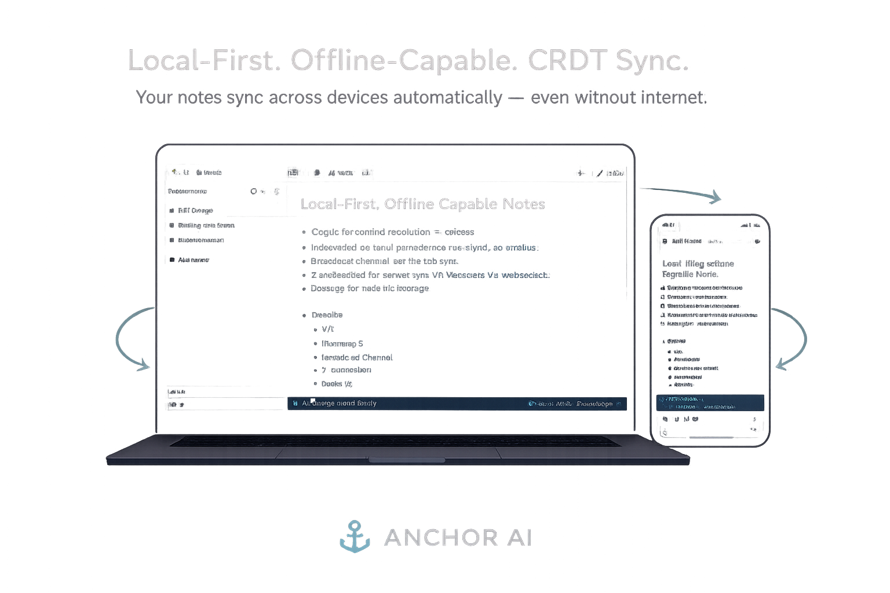

# Anchor

> Notes that work offline. Sync when you're ready. Never lose anything.


<!-- Record a 30-second GIF: open two browser windows side by side, type in one, watch it appear in the other. Then go DevTools → Network → Offline, keep typing, go back online. That's the whole pitch. -->

**[Live App](https://anchor-19sfa4pg2-supratims-projects-a44a3625.vercel.app)** · **[Architecture deep-dive](#how-it-works)**

---

## What it does

Anchor is a note-taking app where your browser is the database. Every keystroke is saved locally before any network call happens — so the app works completely offline, survives tab closures and browser restarts, and never shows you a loading spinner when you're just trying to write.

When you're online, notes sync across your devices automatically. If you edit the same note on your phone and laptop while both are offline, Anchor merges both versions correctly when they reconnect — no data loss, no "which version do you want to keep?" prompt.

---

## How it works

### The local-first architecture

Most apps treat the server as the source of truth and the browser as a thin client. Anchor inverts this. Every note is a **Yjs Y.Doc** — a CRDT (Conflict-free Replicated Data Type) that lives in IndexedDB via `y-indexeddb`. Every keystroke becomes a CRDT operation written locally first. The network is optional.
The sync server is stateless — it relays Yjs update messages between connected clients and stores nothing permanently. If the server is unreachable, the app keeps working. When the server comes back, it exchanges state vectors with each client and replays only the missing operations.

### Why one Y.Doc per note

The alternative — one Y.Doc for all notes — would mean loading the entire CRDT history of every document just to open the app. Instead, each note gets its own Y.Doc, keyed by note ID. A separate **Dexie** (IndexedDB) catalog stores note metadata (title, timestamp, sort order). App load time is constant regardless of how many notes you have.

### Conflict resolution

Yjs uses a variant of the **LSEQ** algorithm for text. If you type "hello" on your laptop and "world" at the same position on your phone while both are offline, Yjs doesn't pick a winner — it merges at the character level using each operation's logical timestamp and author ID. Both devices converge to the same document when they reconnect, deterministically, without server arbitration.

### The sync lifecycle
t0  Online   → Y.Doc updates → persisted to IndexedDB + sent to relay

t1  Offline  → Y.Doc updates → persisted to IndexedDB only (queued)

t2  Reconnect → state vector exchange with relay → missing ops replayed

t3  Other device → receives ops → merges → converges to same state
---

## Tech stack

| Layer | Choice | Why |
|---|---|---|
| Framework | Next.js 16 (App Router) | Routing, deployment, React server components for landing |
| Editor | Tiptap v2 + ProseMirror | Headless, native Yjs collaboration extension |
| CRDT engine | Yjs | Battle-tested, used by Notion, JetBrains, 20k+ apps |
| Local persistence | y-indexeddb | Official Yjs adapter, zero config |
| Tab sync | y-webrtc (BroadcastChannel) | No signaling server needed for same-origin tabs |
| Cross-device sync | y-websocket | Stateless relay, reconnection built in |
| Metadata store | Dexie.js | Clean IndexedDB wrapper for structured note catalog |
| Styling | Tailwind CSS + Shadcn UI | Consistent, accessible, fast to build |
| Sync server | Node.js y-websocket server | Deployed on Railway |
| Deployment | Vercel (frontend) + Railway (sync server) | |

---

## Architecture decisions and tradeoffs

**One Y.Doc per note vs. one shared document**
Chose per-note isolation. Cost: more Y.Doc lifecycle management in the client. Benefit: constant-time app load, no loading the full corpus on startup, cleaner memory footprint. Worth it.

**y-webrtc with empty signaling array for tab sync**
With `signaling: []`, y-webrtc only uses BroadcastChannel — no external server, sub-millisecond tab-to-tab sync, zero cost. Cross-device sync is handled separately by y-websocket.

**Dexie for the metadata catalog instead of Yjs**
Note titles and timestamps are structured relational data. Yjs is optimized for collaborative text, not queryable catalogs. Keeping them separate lets you sort/filter the note list efficiently without touching CRDT state.

**Disabled StarterKit history in Tiptap**
Using the built-in undo/redo with Yjs causes CRDT divergence. Yjs has its own undo manager that operates on CRDT operations rather than editor state snapshots. History is disabled in StarterKit and Yjs UndoManager handles it instead.

---

## Local setup

```bash
# Prerequisites: Node.js 18+

# 1. Clone the repo
git clone https://github.com/codewithsupra/anchor
cd anchor

# 2. Install dependencies
npm install

# 3. Start the sync server (in a separate terminal)
cd sync-server
npm install
npm start
# Runs on ws://localhost:1234

# 4. Start the app
cp .env.example .env.local
# Edit .env.local — set NEXT_PUBLIC_SYNC_SERVER_URL=ws://localhost:1234
npm run dev
# Open http://localhost:3000

# 5. Test multi-tab sync
# Open http://localhost:3000/app in two browser windows side by side
# Type in one — watch it appear in the other

# 6. Test offline
# DevTools → Network → check "Offline" → keep typing → uncheck → sync resumes
```

---

## The demo that closes the deal

Open two browser windows side by side. Open the same note in both. Type in the left window. Characters appear in the right window in real time.

Now: DevTools → Network → **Offline**. Keep typing in the left window. Go back online. Everything syncs. No data lost.

That's the same conflict-free replication technology that powers Figma's collaborative canvas and Notion's real-time editing — running entirely in your browser with a stateless relay server.

---

## What's next

- [ ] Clerk auth — personal notes tied to account across devices  
- [ ] Neon/Postgres for note metadata backup  
- [ ] Collaboration cursors (show who's typing where)  
- [ ] Version history via Yjs snapshots  
- [ ] Chrome extension for one-click capture  
- [ ] End-to-end encryption option  

---

## Built by

**Supratim Sarkar**  · [LinkedIn](https://linkedin.com/in/supratimsarkar99)
